# Building a Farming Copilot Assistant using Generative Answers and Generative Topic Orchestration

In this guide, we will walk through the steps to create a Farming Assistant chatbot using Microsoft Copilot Studio. This Copilot assistant will help farmers by providing information across three scenarios where specific information will reside on three different websites:

- **Providing specific information on farming queries** by searching in depth the public website of the United States Department of Agriculture (USDA) and providing contextual answers to farmer queries.
- **Providing current climate conditions** by querying Weather.com based on the answers received regarding appropriate farming conditions.
- **Providing additional details about loan facilities** by querying the farmers.gov site.

We will leverage Generative Answers and Generative Topic Routing (previously known as Dynamic Chaining) to ensure a seamless and efficient user experience.

## Create the Copilot

1. Head over to the [Copilot Studio](https://copilotstudio.microsoft.com/) and **click** on **Create**.

   

2. Choose to start with a pre-existing copilot template or **create a new Copilot from scratch**. We will create a new one.

   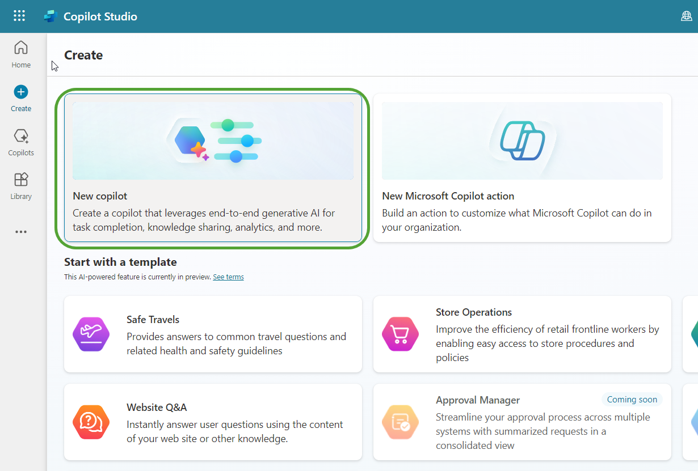

3. Specify the Copilot description.

   

   - Provide instructions on how the copilot should assist.

   

4. For the subsequent question, mention that the website information will be added later when configuring the **Knowledge** section. **Click** on **Create** to provision the Copilot.

   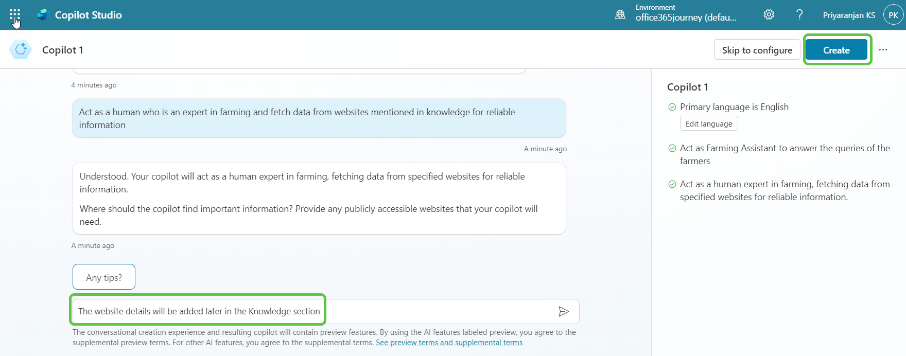

   - The Copilot will be created. **Edit** details like name, description, and add a logo by **clicking** on the **Edit** button.

   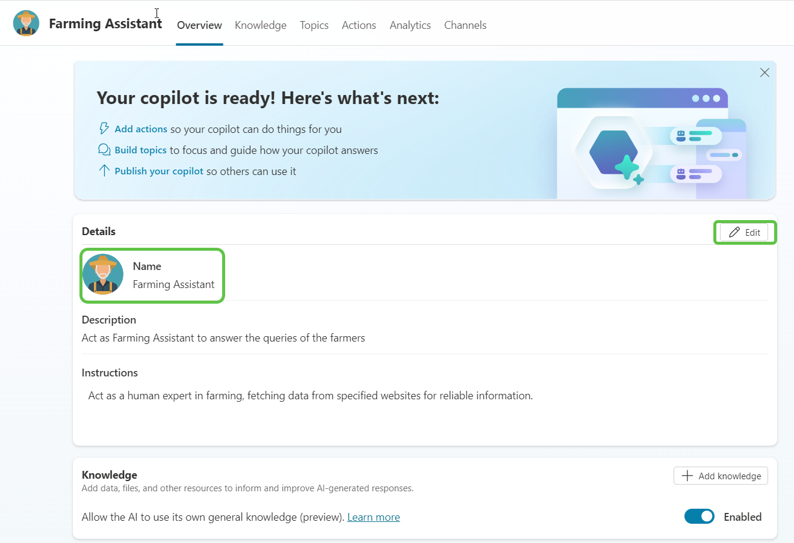

## Add Topics

In Microsoft Copilot Studio, topics are the fundamental building blocks that define how a conversation with a copilot progresses. Here are the key aspects of topics in Copilot Studio:

- **Trigger Phrases:** Phrases, keywords, or questions that a user is likely to use. When a user's input matches these phrases, the corresponding topic is activated.
- **Conversation Nodes:** Action steps within a topic that define what the copilot should do once the topic is triggered. Actions can include asking questions, sending messages, triggering cloud flows, setting variable values, or using branching logic.

 
## Add Topic 1 - Farming Queries

1. **Select** **Topics** from the navigation bar.

   

2. **Create a topic** by selecting **From blank** or **Create from description with Copilot**.

   

   - Name the topic and provide a description of what it should do.

   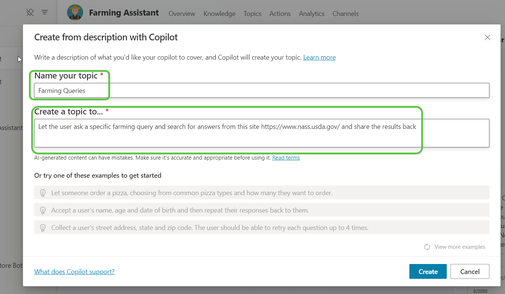

3. Clicking on **Create**, the Topic will be created with the potential trigger phrases and the question node which will be used to accept the question from the User.

   

4. The question provided as user input for the question node will be stored in the **FarmingQuery** variable. **Add a Generative Answers** node and pass in this question as the input.

   - **Click** on the **+** sign, **select** **Advanced**, and then **click** on **Generative Answers**.

     

   - Provide the input to the Generative Answers node by **selecting** the **FarmingQuery** variable.

     

5. **Configure the data source**:

   - **Click** on **Edit** in the Data Sources section.
   - **Select** **Add Knowledge**

     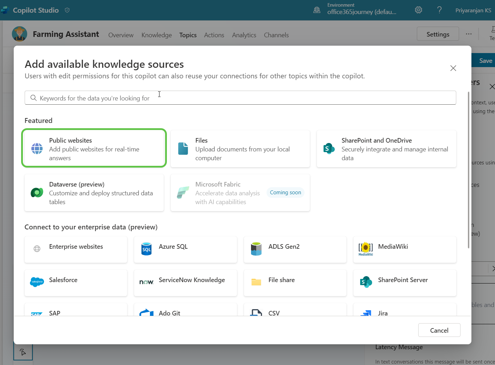

   - It will open up a pop-up from which we can select any of the sources. In this demo, we will select the **Public websites** option to fetch the contextual answers.

     

   - Clicking on Public Websites will provide us the option to add single or multiple websites from which we can fetch the data. In our case, the Farming related information is present on the site: `https://www.nass.usda.gov/`. So, let’s add that to the **Webpage link** section and **Click** on **Add**

     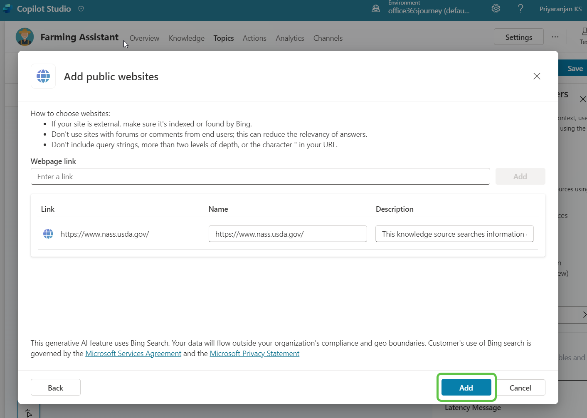
   - If we have more websites from which we need to pick information, we can add it in the webpages link section else click on **Add**
   
     
	 
6. Ensure that this topic fetches only from the mentioned sites:

   - **Select** **Edit** in the Data Sources section
   - **Toggle On** the **Select only selected sources** option
   - **Check** the site that we added
   - **Finally click on Save**

     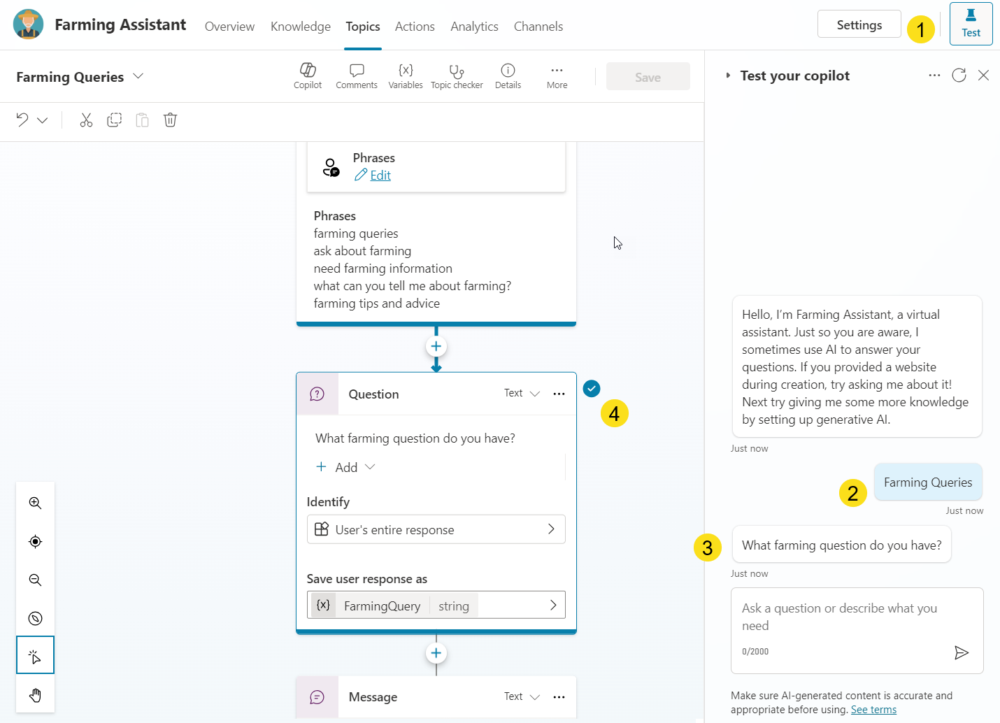

## Test Farming Queries Topic

1. **Click** on the **Test** option in the Copilot canvas.
2. **Enter** one of the trigger phrases, **Farming Queries**, that we had defined which will invoke this specific topic.
3. As a response, the Copilot asks the Question for the user to provide a response.
4. In the Canvas, we can in real-time see which node is being executed currently which helps in debugging the Copilot flow.

   

5. Continue the conversation by providing a response to the question, e.g., **I am starting corn farming, help me with the ideal soil and climate conditions required**.
6. The Copilot will now invoke the generative answers node and use the user query along with the data fetched from the website we mentioned earlier to provide a detailed contextual answer related to the favorable conditions for Corn Farming. It also gives citations from that website for detailed viewing.
7. Finally, we can see in the canvas that the Generative Answers node has successfully completed running.

   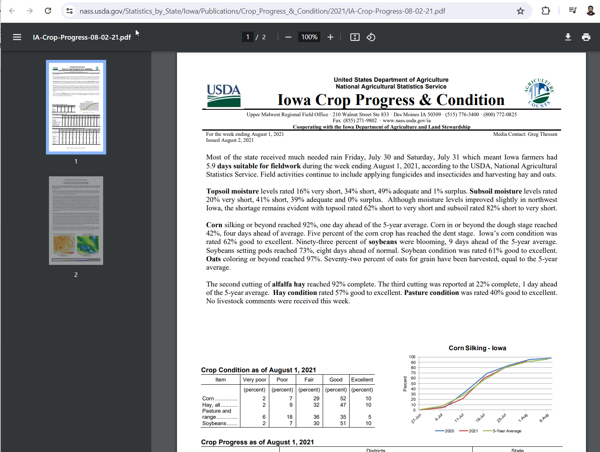

8. If we want to view the citations in detail, we can click on one of the links and it will take us to the USDA (United States Department of Agriculture) site.

   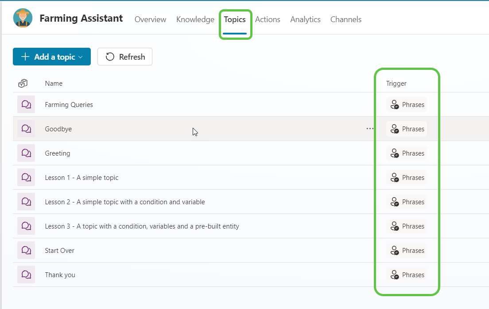

## Enable Generative Conversation Routing (Dynamic Chaining)

Before we move on to the creation of subsequent topics, lets enable Generative Conversation routing (previously known as Dynamic Chaining) to ensure that based on your query, the appropriate topic will be auto selected, and the conversation flow will be routed dynamically to those topics. 
If we go to the Topics section, we can see that the Trigger is Phrases that we defined at the beginning of the topic. 

 

To change this and ensure that Generative AI can route the topics based on user interaction, we will go to **Settings** of the Copilot. 

1. **Go** to **Settings** of the Copilot.

   

2. **Click** on **Generative AI** and **select** **Generative (preview)** to enable the dynamic routing of topics. **Finally Click on Save**

   

4. Now, if we head back to the Topics page, we can see that the Trigger is not the phrases rather it is automatically triggered by the copilot based on the description given during the topic creation.

   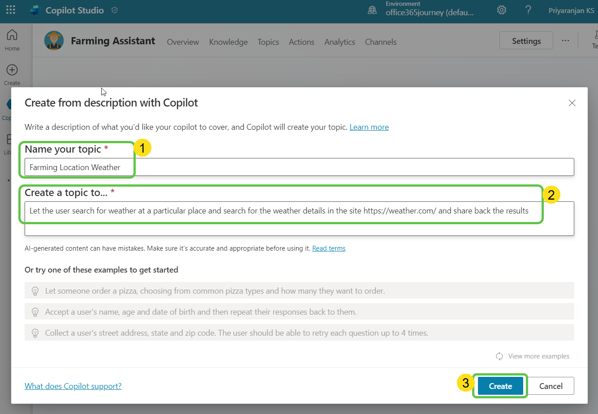

## Add Topic 2 - Farming Location Weather

1. Now that we have received information regarding the adequate conditions needed for Corn Farming through our first topic, we will create a second topic to understand the current weather of the farming location to decide if it matches the mandated conditions by USDA.

   

2. Head to the Topics section and use Copilot to create the topic for us by describing what we intend to achieve with this topic.

   

3. Name the topic as **Farming Location Weather** and the description as **Let the user search for weather at a particular place and search for the weather details on the site https://weather.com/ and share back the results**.

   

4. Ensure that a clear description is given as the Copilot will use this description to create the potential phrases for automatic topic routing as well as the conversational nodes within the topic.

   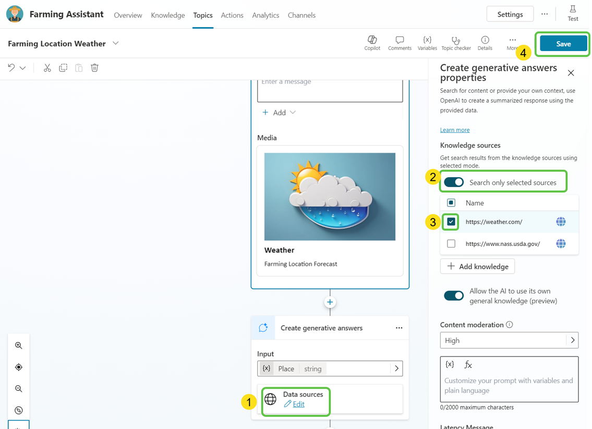

5. Clicking on **Create** will create the topic for us along with the trigger and the conversation starter question.

   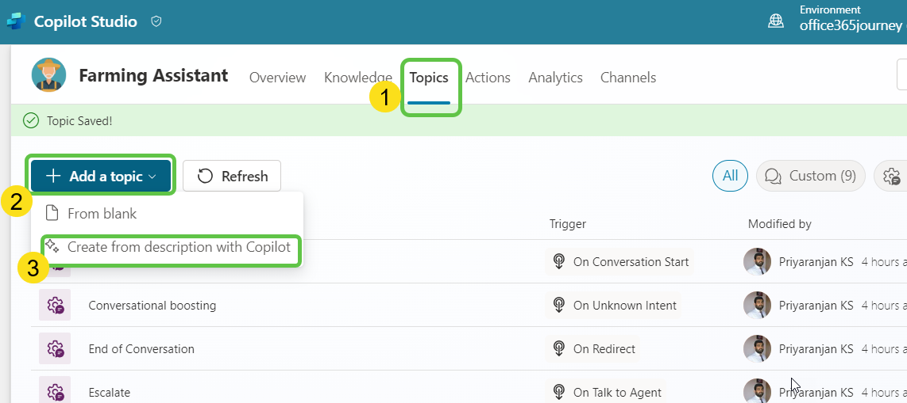

6. The question that the user inputs as a response to the Question node will be saved in the **Place** variable which we will be using down the line.

   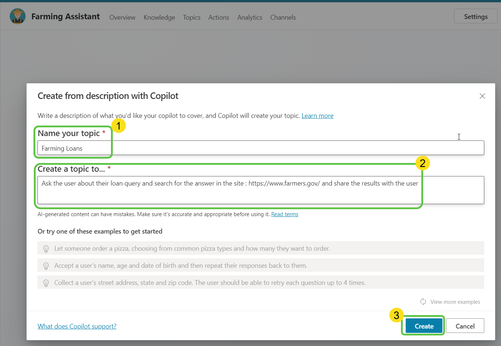

7. We will now edit the Message node, remove the text, and add a basic card to provide a better UX.

   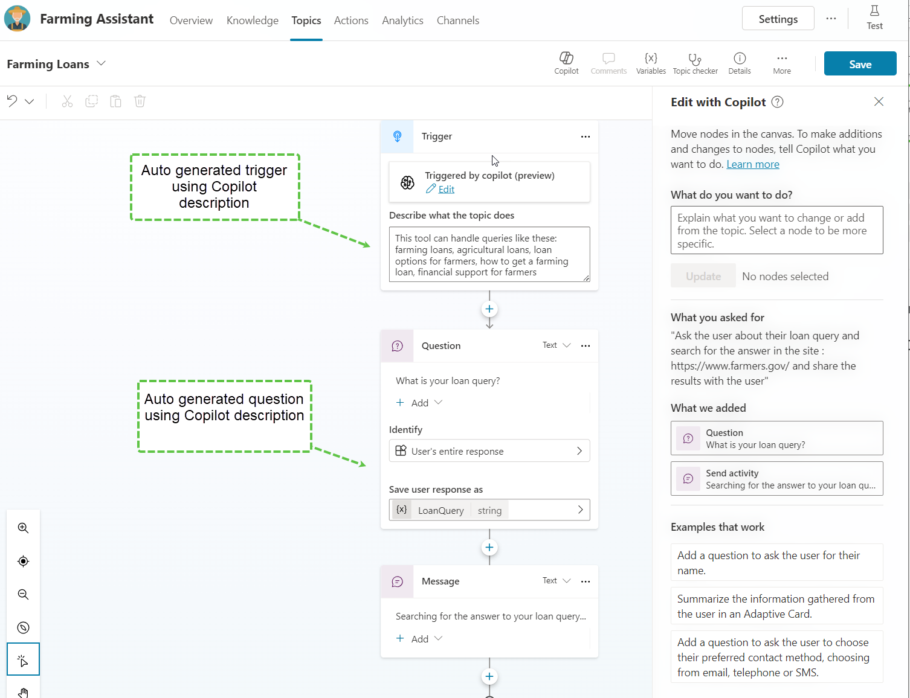

8. Clicking on **Basic Card** will open up the pane where we can provide the card details and the image URL which will be shown in the card in the copilot.

   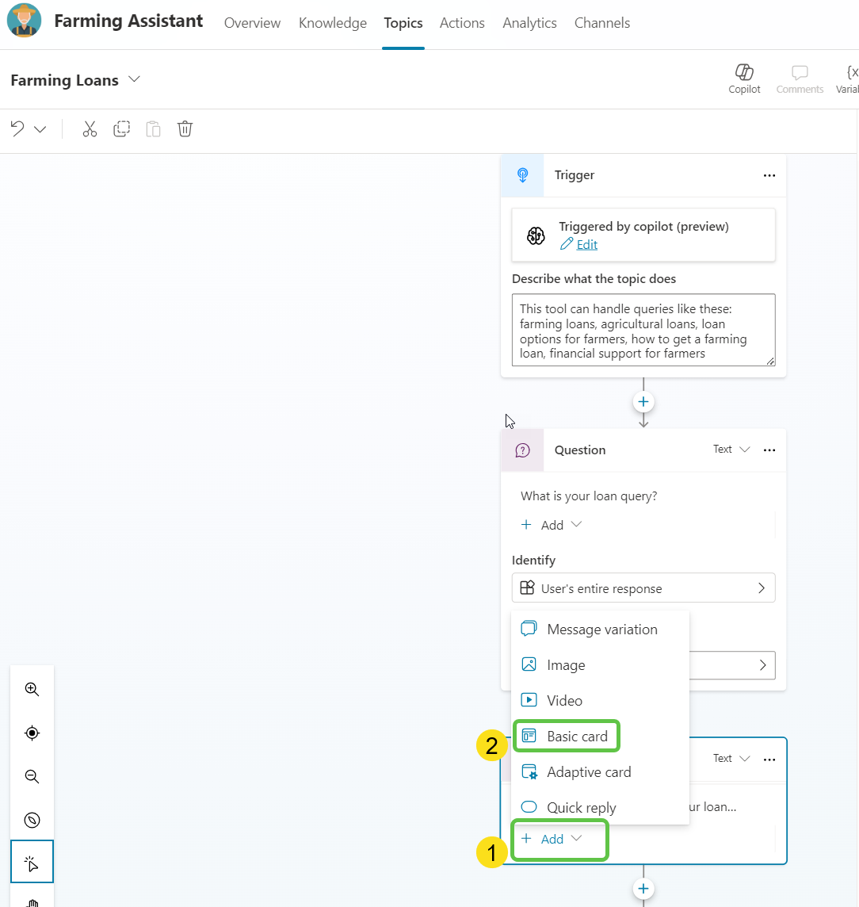

9. Now, let's add the **Generative Answer** node:

   - **Click** on the **+** sign to add the new node.
   - **Select** **Advanced**.
   - **Click** on **Generative Answers**.

     

10. Provide the input to the **Generative Answers** node by:

    - **Selecting** the **>** arrow next to the input field.
    - **Assigning** the **Place** variable to the input field which will contain the question that the user has asked about the weather at a particular place.

      

11. Next, we will edit the Data source for the node by:

    - **Clicking** on the **Edit** button of the Data Sources section.
    - **Select** **Add Knowledge**.

      

12. This will open the pop-up where we will select the **Public websites** as the knowledge source.

    

13. Specify the weather site URL in the webpage link and **click** on **Add**.

    

14. Since we don’t have any more URLs to add, **click** on **Add** to finalize the knowledge base for this topic.

    

15. To ensure that this specific topic will only use the Weather Generative Knowledge Base, we will once again edit the Data source by:

    - **Click** on **Edit** in the Data Source section.
    - **Toggle on** the **Search only selected sources** option.
    - **Check** the Weather site URL.
    - **Finally, Click on Save**.

      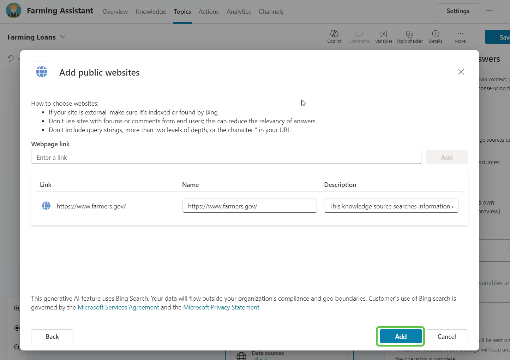

## Add Topic 3 - Farming Loans

1. Now we have configured the topics for getting farming information and the farming location weather. Now we would like to have one final topic to see if we can get any loan assistance from USDA. Let’s create the last topic from the Topics section.

   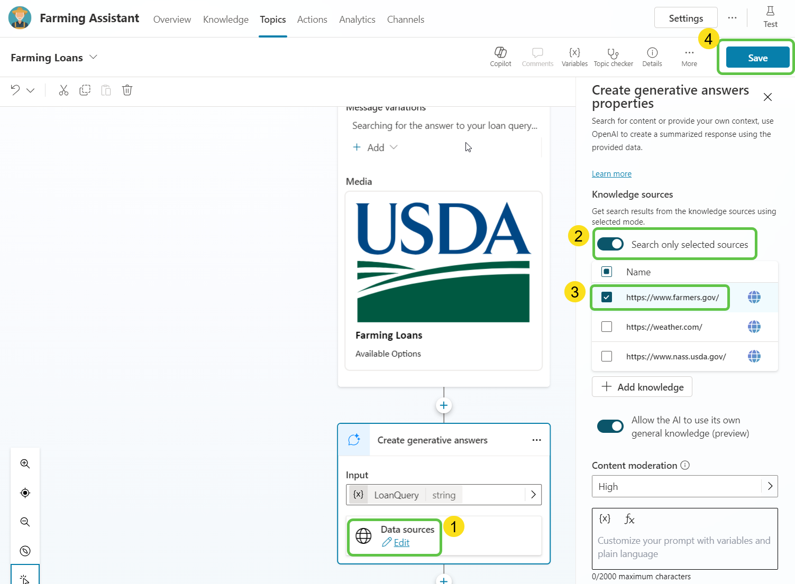

2. Ensure that we give a proper description for the topic so that the trigger and question conversation nodes can be created with accuracy.

   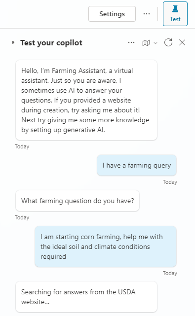

3. We have named the topic as **Farming Loans** and used the description **Ask the user about their loan query and search for the answer on the site: https://www.farmers.gov/ and share the results with the user** for our topic.

   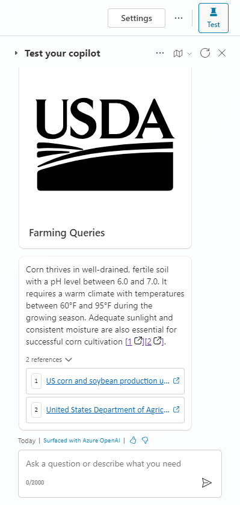

4. Clicking on **Create** will generate the topic for us with the trigger and question derived from the description.

   

5. The question provided by the user as a response to the question node is saved in the **LoanQuery** variable.

   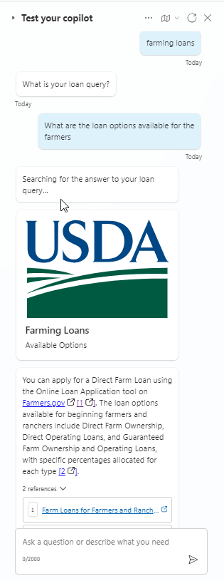

6. Let’s update the message node and add the basic card with an image to provide a better user experience.

   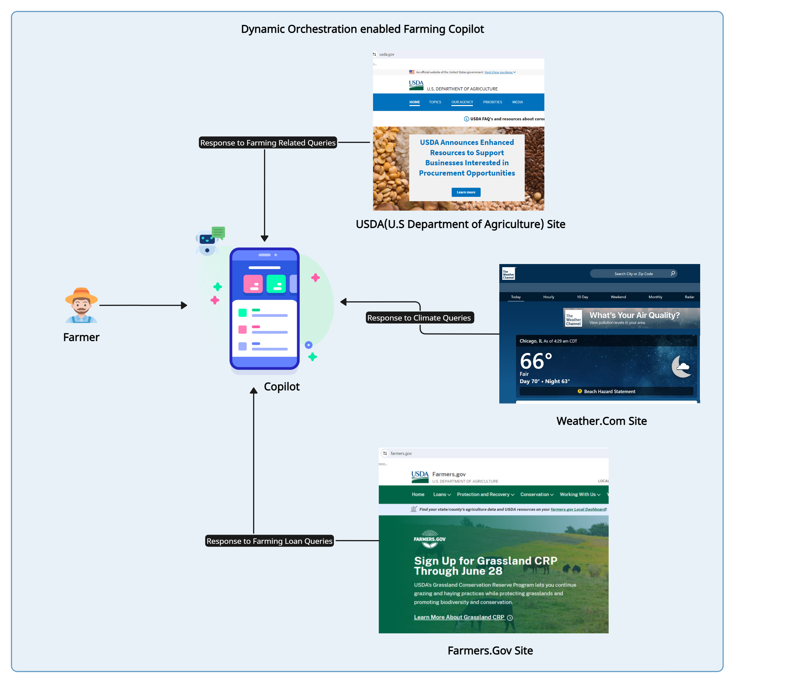

7. We will update the card with details like title and image URL which will be reflected in the message node in the canvas.

   

8. Finally, let’s add the **Generative Answers** node to fetch the answer to the user query from the farmers.gov site by:

   - **Clicking** on the **+** sign to add a new node.
   - **Click** on **Advanced** option.
   - **Select** **Generative Answers**.

     

9. Now let’s update the input to the **Generative Answers** node by:

    - **Clicking** on the **>** in the Input field.
    - **Select** the **LoanQuery** variable and assign it to the input field.

      

10. We can now edit the data source and add the external site URL by:

    - **Click on Edit** in the data source.
    - **Select** **Add Knowledge**.

      

11. This will open the pop-up where we can select the type of Knowledge base. We will go with **Public Websites**.

    

12. Mention the external site URL: `https://www.farmers.gov` in the webpage link and **click** on **Add**.

    

13. **Click on Add** to finalize the knowledge for this topic.

    

14. Finally, to ensure that the Farming Loans topic relies only on the recently added knowledge site, we will:

    - **Click on Edit** in the Data Source section.
    - **Toggle on** the **Search only selected sources** option.
    - **Check** the Farmers site URL.
    - **Finally, Click on Save**.

      

15. Thus we have configured all three topics and have also enabled dynamic routing of topics using Generative AI.

    

## Test the Copilot

1. We will first want to get information about farming queries related to the ideal conditions for corn farming and the Copilot has taken the user query to fetch the generative results from the USDA site.

   

2. It displays back the Soil and Climate condition response to the user query as below:

   

3. Now that we know the climate conditions needed for Corn Farming, let’s try to get the current climate conditions using the below query. It will leverage generative AI to fetch the details from the Weather.com site and even show a citation link to the page where the current climate condition of the farming location will be provided.

   

4. Finally, let’s see if we can get information about the available loan options to proceed with the farming. We can see that it successfully orchestrates the conversation to the appropriate topic and uses generative answers to fetch the details from the farmers.gov site.

   

## Conclusion

In this guide, we've created a powerful Farming Assistant chatbot using Microsoft Copilot Studio. By leveraging Generative Answers and Generative Topic Orchestration, we've enabled the Farming Assistant to provide seamless, contextually accurate information across various farming-related queries. This assistant integrates data from three distinct public websites, ensuring comprehensive support for farmers:

1. **USDA** for detailed farming information and best practices.
2. **Weather.com** for real-time weather updates pertinent to farming locations.
3. **Farmers.gov** for information on available loan options and financial assistance.

By enabling dynamic topic routing and configuring targeted data sources, we've created a robust and intelligent Copilot that can dynamically handle user queries and provide precise answers grounded in reliable information. This Farming Assistant not only simplifies the decision-making process for farmers but also demonstrates the potential of Microsoft Copilot Studio in creating sophisticated AI solutions.

This project highlights the effectiveness of combining generative AI with well-structured topic orchestration, setting a precedent for developing other domain-specific assistants.
